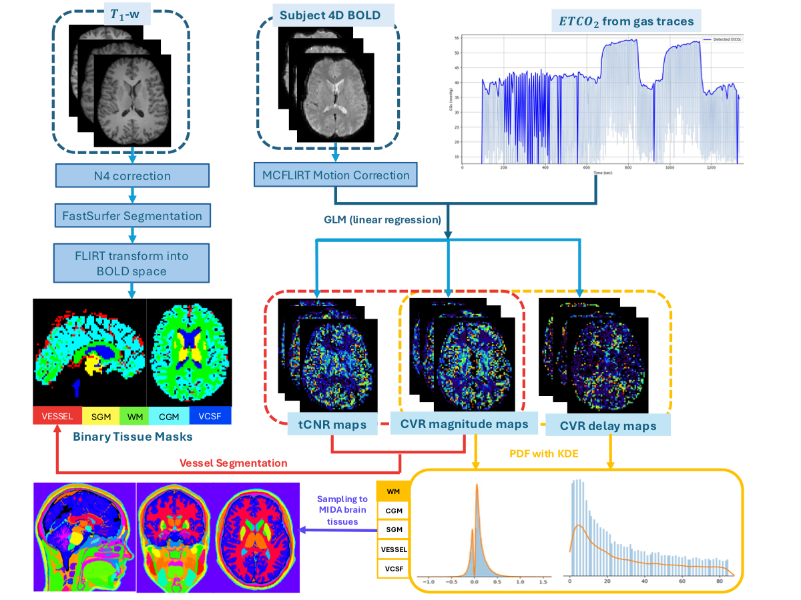
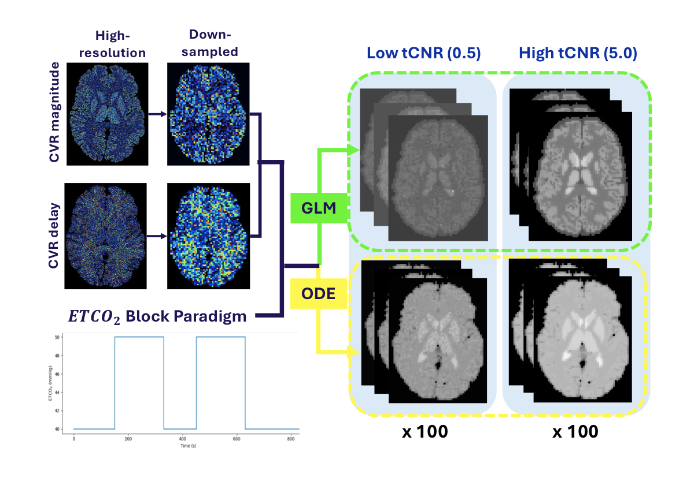

# MPhys-CVR-PINN

MPhys project code for simulation-based evaluation of cerebrovascular reactivity (CVR) mapping in BOLD MRI using physics-informed neural networks (PINNs). The thesis is available here: [MPhys_project_thesis.pdf](https://github.com/user-attachments/files/26659896/A_Template_for_MPhys_Project_Reports-2.pdf)


This repository contains research scripts for:

- simulating BOLD data from CVR magnitude and delay maps
- training and adapting PINN models for voxelwise CVR estimation
- generating conventional GLM CVR baselines
- preparing ROI masks and BIDS-aligned neuroimaging inputs
- summarising ROI-wise distributions and quality-control outputs

## Pipeline Diagrams

<p align="center">
  <a href="./docs/pdfs/DataProcessPipeline.pdf">
    
  </a>
  <a href="./docs/pdfs/simulation_pipeline.pdf">
    
  </a>
</p>

- [Open Data Processing Pipeline PDF](./docs/pdfs/DataProcessPipeline.pdf)
- [Open Simulation Pipeline PDF](./docs/pdfs/simulation_pipeline.pdf)

## Project Overview

The codebase is organised around a workflow that starts with anatomical and ROI preparation, builds simulated or processed BOLD inputs, and then compares PINN-based CVR estimation against more conventional analysis pipelines.

This is a script-based research repository rather than a packaged Python library. Several scripts still contain machine-specific default paths, so it is a good idea to review command-line arguments before running anything on a new system.

## Main Script Groups

### Simulation and Synthetic Data

- `sim_ode.py`: chunked dynamic BOLD simulator using high-resolution CVR magnitude and delay maps, ROI masks, and ROI-specific baseline signal values
- `tissue_baseline.py`: generates lower-resolution baseline/simulation inputs from high-resolution CVR magnitude and delay maps
- `simwithsmooth.py`: simulation experiments with smoothing, tCNR control, and BOLD synthesis
- `cvr_from_pdf.py`, `make_pdf.py`, `mida_maps_pdf.py`: create ROI-specific distributions and sampled CVR magnitude/delay inputs

### PINN Training and Adaptation

- `pinnmodel.py`: trains a voxelwise PINN on simulated BOLD data and evaluates CVR magnitude and delay predictions
- `submodel.py`: adapts pretrained PINN checkpoints to unseen BOLD images, including support for external EtCO2 traces
- `pinn_40_ssh.py`, `pinn_60.py`, `submodel.py`: related PINN training and adaptation workflows
- `vsGT.py`, `BA.py`: comparison and agreement analysis against ground truth or baseline methods

### GLM and Conventional CVR Mapping

- `run_glm.py`: batch CVR GLM over simulated BOLD NIfTI data with variable delay handling
- `fast_glm.py`: fast GLM pipeline for CVR magnitude and delay estimation
- `cvr_map.py`: earlier script for voxelwise CVR/delay calculation from BOLD, masks, and EtCO2 traces

### ROI, Segmentation, and BIDS Utilities

- `fastsurfer_seg.py`: derives WM, subcortical GM, cortical GM, and vCSF masks from FastSurfer outputs
- `T12bold_bids.py`: registers T1-space segmentations into BOLD space
- `vesselseg_bids.py`, `segmask2bold_bids.py`, `roierosion_bids.py`, `roidist_bids.py`, `roijson_bids.py`: ROI preparation and configuration helpers

### QC and Distribution Analysis

- `hv_dist_mat.py`: extracts pooled ROI-wise CVR magnitude and delay distributions from BIDS-organised datasets
- `kde_plot.py`, `tcnr_ratio.py`, `gastraces.py`: visualisation and QC utilities

## Expected Inputs

Most scripts assume some combination of:

- 3D or 4D NIfTI files (`.nii` or `.nii.gz`) for BOLD, CVR magnitude, CVR delay, and binary masks
- BIDS-style subject and session folders for preprocessing utilities
- EtCO2 traces from a built-in protocol or external `.txt`, `.csv`, or `.npy` files
- pretrained PyTorch checkpoints for PINN adaptation workflows

## Environment Setup

Create a virtual environment and install the core Python dependencies:

```bash
python -m venv .venv
source .venv/bin/activate
pip install numpy scipy pandas matplotlib nibabel nilearn nipype scikit-image scikit-learn torch
```

Some scripts also depend on external neuroimaging tools:

- FSL/FLIRT for registration workflows such as `T12bold_bids.py`

## Typical Workflow

1. Prepare anatomical segmentations and ROI masks.
2. Register masks into BOLD space for each subject/session.
3. Build empirical ROI distributions or generate synthetic CVR magnitude and delay inputs.
4. Simulate BOLD data with controlled tCNR and timing parameters.
5. Train or adapt a PINN to estimate CVR magnitude and delay from BOLD time series.
6. Compare the PINN outputs with GLM baselines and ROI-level summary metrics.

## Example Commands

Generate simulated BOLD data from high-resolution CVR maps:

```bash
python sim_ode.py \
  --cvr-mag path/to/CVR_mag_mida.nii.gz \
  --delay path/to/CVR_delay_mida.nii.gz \
  --s0-json path/to/s0_by_roi.json \
  --out-root outputs/simulated \
  --n-reps 100 \
  --tcnr-list 5.0,10.0
```

Train the PINN on simulated BOLD images:

```bash
python pinnmodel.py \
  --train-bold-glob "path/to/simulated/*.nii.gz" \
  --gt-cvr path/to/gt_cvr_mag_2p5mm.nii.gz \
  --gt-delay path/to/gt_delay_2p5mm.nii.gz \
  --outdir outputs/pinn
```

Run the fast GLM baseline on simulated BOLD data:

```bash
python run_glm.py \
  --in_dir path/to/simulated \
  --out_dir outputs/glm \
  --brain_mask path/to/simbold_mask.nii.gz
```

## Notes

- Check each script with `python <script>.py --help` before use, especially if you are running outside the original development environment.
- Some defaults point to absolute local paths from the original project machine and should be overridden with your own paths.
- The repository currently stores scripts directly at the top level rather than as an installable Python package.
